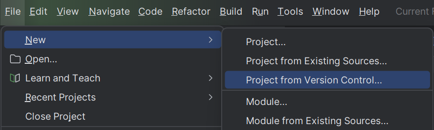

# Aprendiendo GitHub
## Markdown
Este proyecto ha sido una práctica para aprender a crear repositorios en **git** en local y 
luego subirlos a **github**. Se pueden encontrar clases como *Saludo* o *Despedida* en los cuales
se han encontrado y arreglado errores a la hora de hacer `git merge (rama)` por un conflicto en el código.

### ¿Cómo clonar este proyecto?
1. Copiar el enlace al repositorio
```
https://github.com/hectorcorteell/github.git
```
2. Crear un proyecto desde un repositorio clonado



3. Pegar el enlace y clonar

### Enlances que te serán de ayuda
* [Creación repositorios en GitHub](https://docs.github.com/es/repositories/creating-and-managing-repositories/quickstart-for-repositories)
* [Markdown 2](./src/MARKDOWN.md)

| Comando | Función |
| ----------- | ----------- |
| git init | Crear repositorio |
| git add . | Añade todos los archivos a la *Staging Area* |
